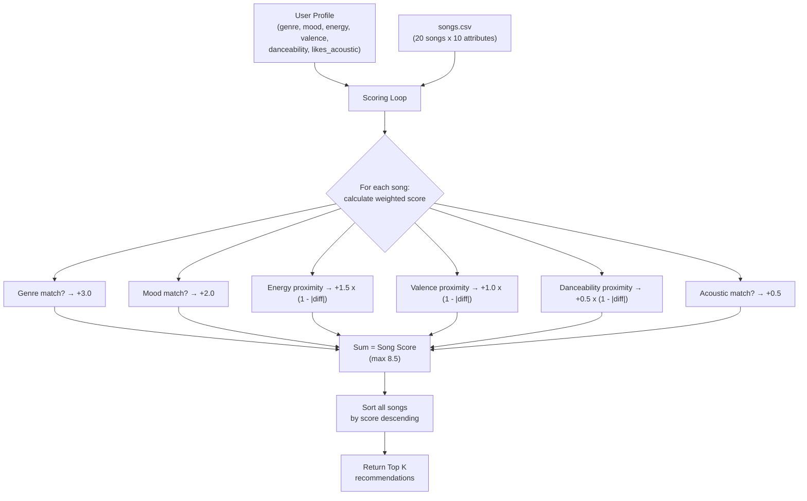
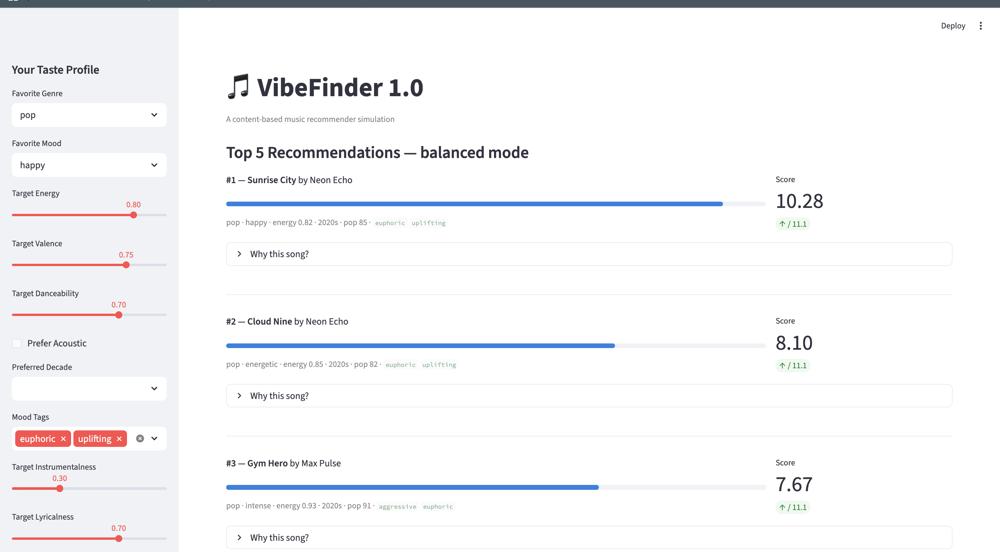
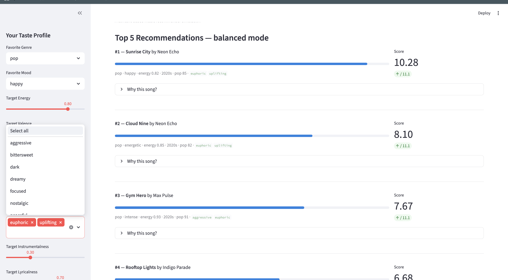
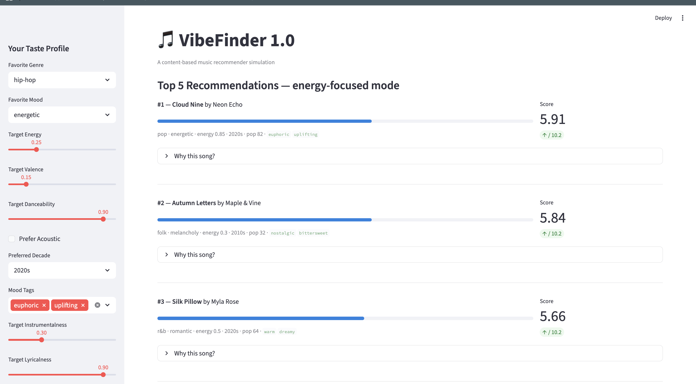
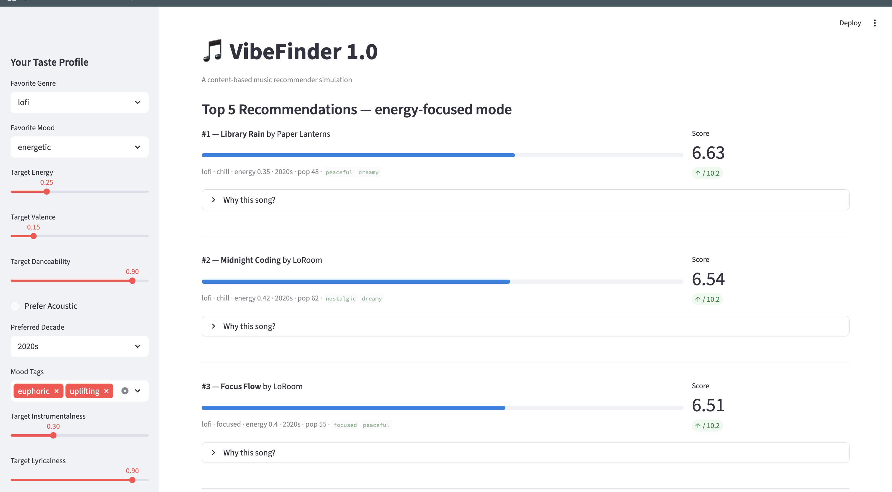

# 🎵 Music Recommender Simulation

## Project Summary

This project is a simplified content-based music recommender that scores and ranks songs from a small catalog based on a user's taste profile. It mirrors the core logic used by platforms like Spotify and YouTube Music: each song's attributes are compared against a user's preferences, a weighted score is calculated, and the top-scoring songs are returned as recommendations. The system is designed for classroom exploration and demonstrates how real AI recommenders turn raw data into personalized suggestions.

---

## How The System Works

### How Real-World Recommendations Work

Production recommenders like Spotify combine two approaches. **Collaborative filtering** finds patterns across millions of users — if people with similar taste to yours love a song, it gets recommended to you, even if it sounds nothing like what you usually play. **Content-based filtering** analyzes the song itself — its tempo, energy, mood, and audio features — and recommends tracks that are sonically similar to ones you already enjoy. Spotify's Discover Weekly, for example, uses collaborative filtering to generate candidates, then content-based filtering to refine them, and finally a satisfaction prediction model to re-rank the results. Our simulation focuses on the content-based approach, which is the most tractable to implement with a small catalog and no multi-user interaction data.

### What Our Version Prioritizes

This system uses a **weighted proximity scoring model**. Rather than checking whether a song's energy is simply "high" or "low," it measures how close each song's attributes are to the user's preferred values. A song that is close to what you want scores high; a song that is far away scores low. Categorical features (genre, mood) are scored as binary matches, while numeric features (energy, valence, danceability) use a distance-based proximity formula: `score = 1.0 - |song_value - user_preference|`. Acousticness uses a threshold-based binary match.

### Data Flow



### Features Used

**`Song` attributes (from `data/songs.csv`, 20 songs):**
- `genre` (categorical) — 15 genres: pop, lofi, rock, jazz, ambient, synthwave, indie pop, hip-hop, folk, electronic, classical, metal, latin, r&b, country
- `mood` (categorical) — 10 moods: happy, chill, intense, relaxed, moody, focused, melancholy, energetic, angry, romantic
- `energy` (0.0–1.0) — intensity and activity level
- `valence` (0.0–1.0) — emotional positiveness (happy vs. sad)
- `danceability` (0.0–1.0) — rhythmic suitability for dancing
- `acousticness` (0.0–1.0) — degree of acoustic instrumentation
- `tempo_bpm` (numeric) — beats per minute (available in data but not used in scoring due to redundancy with energy)

**`UserProfile` preferences:**
- `favorite_genre` — preferred genre (binary match against song genre)
- `favorite_mood` — preferred mood (binary match against song mood)
- `target_energy` — ideal energy level (proximity-scored)
- `likes_acoustic` — preference for acoustic sound (threshold at 0.6)

### Algorithm Recipe

Each song receives a weighted score computed as follows:

| Component | Rule | Points |
|---|---|---|
| Genre match | `+3.0` if `song.genre == user.favorite_genre` | 0 or 3.0 |
| Mood match | `+2.0` if `song.mood == user.favorite_mood` | 0 or 2.0 |
| Energy proximity | `1.5 * (1.0 - \|song.energy - user.target_energy\|)` | 0.0 – 1.5 |
| Valence proximity | `1.0 * (1.0 - \|song.valence - target\|)` | 0.0 – 1.0 |
| Danceability proximity | `0.5 * (1.0 - \|song.danceability - target\|)` | 0.0 – 0.5 |
| Acoustic match | `+0.5` if preference aligns with song (threshold: 0.6) | 0 or 0.5 |

**Maximum possible score: 8.5 points.** Songs are sorted by score descending and the top *k* are returned.

### Expected Bias and Limitations

- **Genre dominance:** At 3.0 points, genre match is the single heaviest factor. A perfect mood + numeric match without genre tops out at 5.5, while a genre match alone starts at 3.0. This means the system will almost never recommend a song outside the user's preferred genre, even if it matches every other dimension perfectly. This mirrors a real filter-bubble problem.
- **Catalog bias:** With only 1–2 songs per genre, entire listener types (e.g., classical fans) have very few options and may get poor recommendations simply due to lack of variety.
- **No cross-genre discovery:** Unlike collaborative filtering, this system cannot learn that "people who like lofi also tend to like ambient" — it treats each genre as an isolated silo.
- **Binary acoustic preference:** The `likes_acoustic` boolean is coarse. A user who somewhat enjoys acoustic music is treated the same as one who exclusively listens to it.

---

## Getting Started

### Setup

1. Create a virtual environment (optional but recommended):

   ```bash
   python -m venv .venv
   source .venv/bin/activate      # Mac or Linux
   .venv\Scripts\activate         # Windows

2. Install dependencies

```bash
pip install -r requirements.txt
```

3. Run the app:

```bash
python -m src.main
```

### Running Tests

Run the starter tests with:

```bash
pytest
```

You can add more tests in `tests/test_recommender.py`.

---

## Screenshots

### Balanced Mode — Pop / Happy Profile

The default view showing VibeFinder with a pop/happy user profile in balanced scoring mode. Sunrise City takes #1 at 10.28/11.1.



### Mood Tags Dropdown

The sidebar mood tag selector showing all available tags (aggressive, bittersweet, dark, dreamy, focused, nostalgic, etc.) that users can pick to fine-tune recommendations.



### Energy-Focused Mode — Hip-Hop / Energetic Profile

Switching to energy-focused mode with a hip-hop/energetic profile. Cloud Nine takes #1 and Autumn Letters shows up at #2 — the system prioritizes energy proximity over genre match in this mode.



### Energy-Focused Mode — Lofi / Energetic Profile

Same energy-focused mode but with a lofi/energetic profile. Library Rain, Midnight Coding, and Focus Flow cluster tightly at 6.63, 6.54, and 6.51 — showing how lofi songs score similarly when energy is the dominant weight.



---

## Experiments You Tried

**Weight experiment — genre halved (1.5), energy doubled (3.0):**

- For the **High-Energy Pop Fan**, Rooftop Lights (indie pop/happy) jumped from #4 to #2, overtaking Cloud Nine and Gym Hero. With less genre dominance, mood match + energy proximity became more competitive than genre alone. The system started recommending more by "feel" than by label.
- For the **Conflicting profile** (high energy + melancholy folk), Autumn Letters stayed #1 but its lead shrank from 4.5 points over #3 to just 2.0 points. High-energy songs like Burning Asphalt climbed closer because the doubled energy weight rewarded their proximity to the user's target of 0.95.
- For the **Chill Lofi Listener**, Spacewalk Thoughts (ambient/chill) jumped from #4 to #3, nearly catching Focus Flow (lofi/focused). The reduced genre penalty let cross-genre mood matches compete.

**Key finding:** Genre weight is the primary driver of filter bubbles. Reducing it from 3.0 to 1.5 opened up cross-genre discovery, but also introduced some results that felt less "on-brand" for the user.

**Profile diversity testing:**

- All 3 core profiles (Pop, Lofi, Rock) produced distinct, intuitive #1 picks with scores above 8.3/8.5.
- The adversarial profile (high energy + melancholy folk) revealed that genre+mood (5.0 pts combined) can override even a massive energy mismatch (0.65 gap). The system recommended a calm folk song to a user who asked for intensity.
- The edge case profile (acoustic classical romantic) got Moonlit Sonata #1 despite a mood mismatch ("relaxed" vs "romantic") — genre weight alone outweighed mood.

---

## Limitations and Risks

- **Tiny catalog** — only 20 songs across 15 genres means most genres have just 1 representative, giving fans of those genres no variety.
- **Genre over-prioritization** — at 3.0 points, genre match dominates scoring. A song outside the user's genre almost never cracks the top 3 even with perfect mood/energy matches.
- **No understanding of lyrics, language, or cultural context** — the system treats all songs as bags of numbers and labels.
- **No feedback loop** — the system never learns whether the user actually liked a recommendation, so it cannot improve over time.
- **Conflicting preferences break the system** — a user who wants both "high energy" and "melancholy folk" gets a low-energy folk song because categorical matches outweigh numeric distance.

See the full analysis in [model_card.md](model_card.md).

---

## Reflection

[**Model Card**](model_card.md)

Both tests passing after all the changes which was a relief honestly:

```
$ pytest tests/ -v
============================= test session starts ==============================
platform darwin -- Python 3.14.3, pytest-9.0.2, pluggy-1.6.0
rootdir: /Users/kali/ai110-module3show-musicrecommendersimulation-starter
collecting ... collected 2 items

tests/test_recommender.py::test_recommend_returns_songs_sorted_by_score PASSED [ 50%]
tests/test_recommender.py::test_explain_recommendation_returns_non_empty_string PASSED [100%]

============================== 2 passed in 0.00s ===============================
```

The main thing I learned is that recommenders are really just weighted math under the hood. You take a users preferences, compare them to each song's attributes, and add up the points. It sounds simple but it actually works pretty well — when I ran the pop/happy profile the top results genuinley felt like songs I'd want to listen to. The weights you pick matter a ton though. Setting genre to 3.0 made the system feel accurate for straightforward profiles, but it also meant the system could basiclly never recommend something outside your favorite genre even if the mood and energy were a perfect match.

The bias thing was interesting to see firsthand. Its in the data and the weights. Genres like classical and metal only have 1 song each, so fans of those genres get a way worse experience than pop or lofi fans who have 3 options. And the weights themselves are biased — giving genre 3.0 points means we're assuming genre matters 6x more than acousticness, which might be true for some people but definately not everyone. When I halved the genre weight in my experiment, cross-genre recs started showing up right away, which showed how much that one number was holding the system back. If this was a real product it would totally under-serve people with more eclectic taste.

